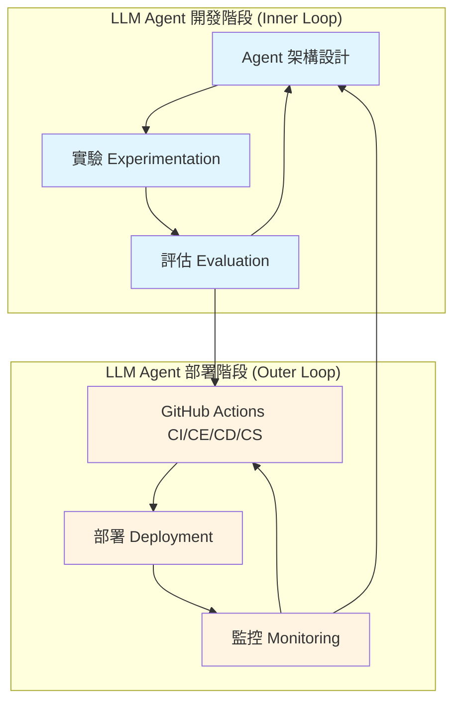
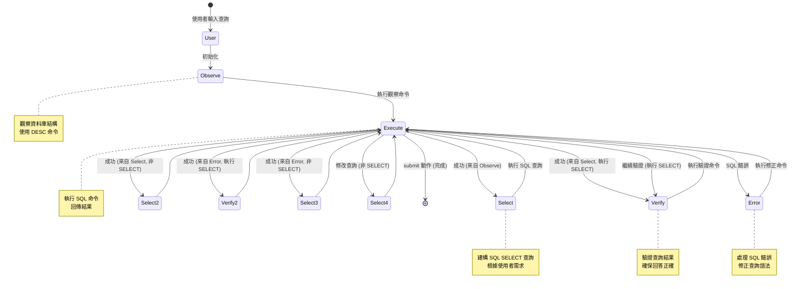
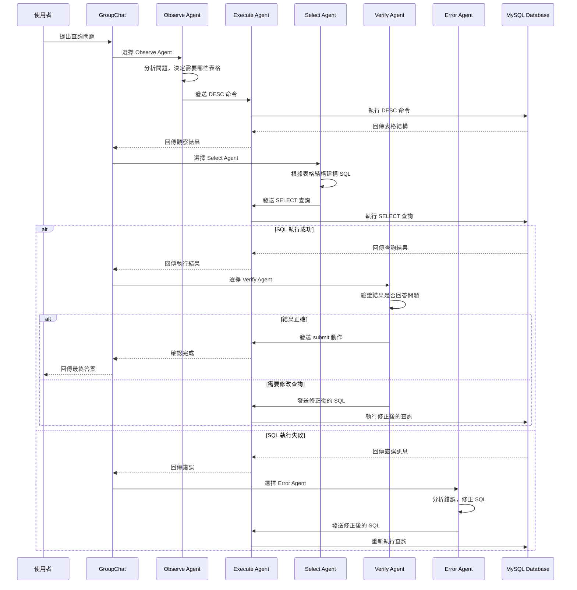
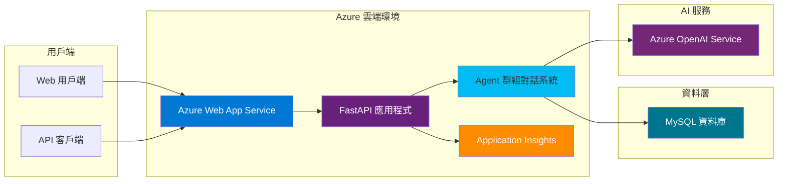
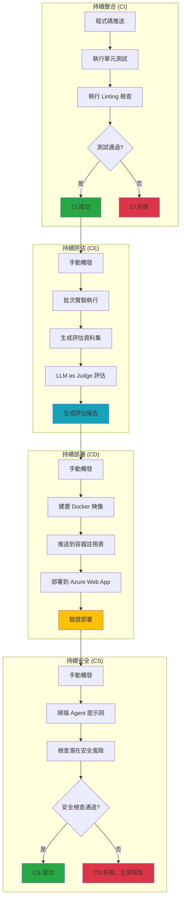
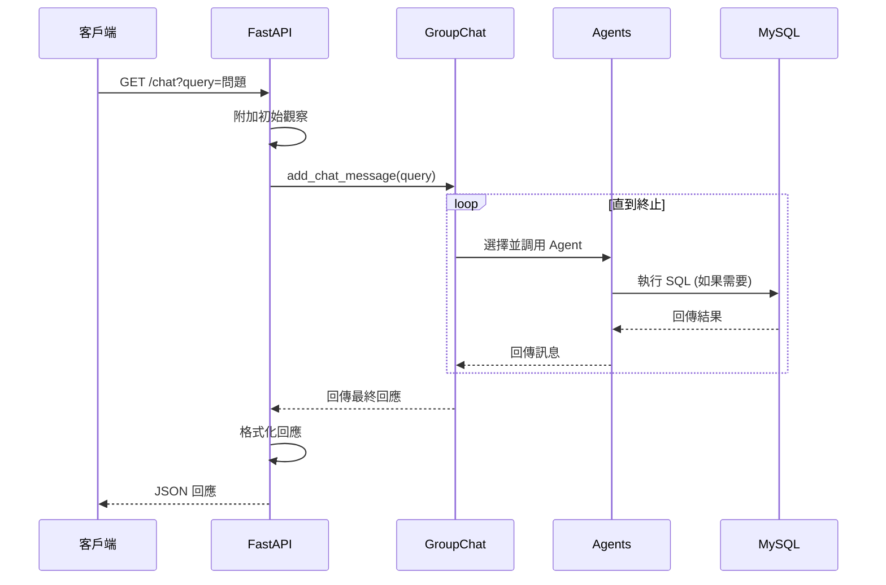
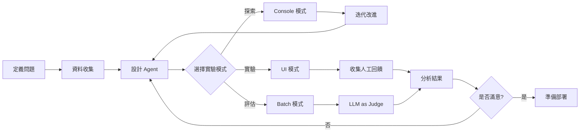
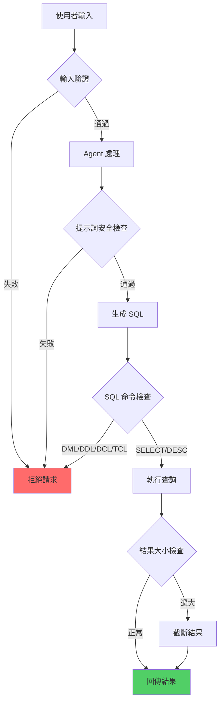

# LLMAgentOps Toolkit 技術文件 (繁體中文)

## 目錄

1. [專案概述](#專案概述)
2. [核心架構](#核心架構)
3. [系統流程圖](#系統流程圖)
4. [模組詳細說明](#模組詳細說明)
5. [開發與部署](#開發與部署)
6. [實驗與評估](#實驗與評估)
7. [安全性](#安全性)

---

## 專案概述

`LLMAgentOps Toolkit` 是一個基於 Semantic Kernel 建構的大型語言模型 (LLM) Agent 應用程式開發框架。本工具包旨在為資料科學家和開發人員提供從實驗、評估到生產部署的完整開發流程。

### 核心特色

- **基於 StateFlow 的工作流程**: 採用有限狀態機 (FSM) 概念進行 Agent 協調
- **模組化設計**: 清晰分離核心邏輯 (Core) 與營運程式碼 (Ops)
- **完整的開發生命週期**: 涵蓋實驗、評估、部署、監控全流程
- **內建安全防護**: 多層次的安全檢查機制
- **可觀測性**: 整合 OpenTelemetry 進行完整的追蹤與監控

### 示例應用：MySQL Copilot

本專案實作了一個 MySQL Copilot 示例，展示如何使用 StateFlow 架構建立一個能夠透過自然語言查詢 MySQL 資料庫的智能助手。

---

## 核心架構

### 整體架構圖



### 程式碼結構

```
llm-agent-ops-toolkit-sk/
├── src/                          # 核心原始碼
│   ├── agents/                   # Agent 實作
│   │   ├── base.py              # Agent 基礎類別
│   │   ├── observe.py           # 觀察 Agent
│   │   ├── select.py            # 選擇 Agent
│   │   ├── verify.py            # 驗證 Agent
│   │   ├── error.py             # 錯誤處理 Agent
│   │   └── execute.py           # 執行 Agent
│   ├── groupchat/               # 群組對話協調
│   │   ├── state_flow_chat.py
│   │   ├── state_flow_selection_strategy.py
│   │   └── state_flow_termination_strategy.py
│   ├── logging/                 # 日誌與追蹤
│   ├── mysql/                   # MySQL 互動
│   └── utils/                   # 工具函式
├── experimentation/             # 實驗環境
├── evaluation/                  # 評估工具
├── security/                    # 安全掃描
├── tests/                       # 單元測試
├── app_rest_api.py             # REST API 伺服器
└── .github/workflows/          # CI/CD 工作流程
```

---

## 系統流程圖

### StateFlow 狀態轉換圖

本系統採用 StateFlow 架構，這是一個基於有限狀態機的 LLM 工作流程。下圖展示了 Agent 之間的狀態轉換邏輯：



### Agent 交互序列圖



### 系統部署架構圖



### CI/CE/CD/CS 工作流程圖



---

## 模組詳細說明

### 1. Agent 系統 (src/agents/)

#### 1.1 StateFlowBaseAgent (base.py)

**功能**: 所有 Agent 的基礎類別，繼承自 Semantic Kernel 的 `ChatCompletionAgent`。

**核心方法**:
- `__init__()`: 初始化 Agent，設定服務 ID、核心、名稱、描述和執行設定
- `invoke()`: 異步調用聊天完成服務，處理對話歷史並生成回應

**特殊功能**:
- 自動處理 "Thought" 和 "Action" 的格式化
- 當 LLM 未能生成完整的 Thought-Action 時，會自動進行第二次調用

**程式碼範例**:
```python
# 繼承 StateFlowBaseAgent 建立自定義 Agent
class CustomAgent(StateFlowBaseAgent):
    async def invoke(self, history: ChatHistory):
        # 自動處理 Thought 和 Action 格式
        async for message in super().invoke(history):
            yield message
```

#### 1.2 AgentObserve (observe.py)

**功能**: 觀察資料庫結構的 Agent。

**職責**:
- 使用 `DESC` 或 `DESCRIBE` 命令了解相關表格的結構
- 判斷問題是否涉及資料操作，如果是則中止查詢
- 每次只發送一個 DESC 命令

**安全防護**:
- 明確指示避免 DML (資料操作語言)、DDL (資料定義語言)、DCL (資料控制語言)、TCL (交易控制語言) 查詢

**提示詞範例**:
```
Thought: 我需要了解 customers 表格的結構來回答這個問題
Action: execute[DESC customers]
```

#### 1.3 AgentSelect (select.py)

**功能**: 建構 SQL SELECT 查詢的 Agent。

**職責**:
- 根據表格理解和問題，精確地構建 SQL SELECT 查詢
- 使用適當的子句 (WHERE、JOIN、GROUP BY、HAVING 等)
- 只選擇問題要求的欄位，避免不必要的資訊

**最佳實踐**:
- 如果問題要求計數，輸出應該是單一數字
- 不需要 CAST 或 ROUND，除非問題明確要求
- 避免選擇無關的欄位（如 ID）

**提示詞範例**:
```
Thought: 我應該寫一個 SQL 命令，依產品庫存升序選擇產品名稱
Action: execute[SELECT name FROM products ORDER BY stocks ASC]
```

#### 1.4 AgentVerify (verify.py)

**功能**: 驗證 SQL 查詢結果的 Agent。

**職責**:
- 檢查輸出是否精確回答問題
- 確保輸出只顯示問題要求的欄位
- 如果需要，修改查詢或使用 DESC 學習更多關於表格的資訊
- 如果輸出正確，提交查詢

**驗證邏輯**:
```
如果輸出包含額外欄位 -> 修改查詢
如果輸出未回答問題 -> 修改查詢
如果輸出精確回答問題 -> submit
```

#### 1.5 AgentError (error.py)

**功能**: 處理 SQL 執行錯誤的 Agent。

**職責**:
- 分析 SQL 錯誤訊息
- 理解錯誤原因（語法錯誤、表格不存在、欄位錯誤等）
- 生成修正後的 SQL 查詢
- 必要時使用 DESC 命令獲取更多資訊

**錯誤處理流程**:
1. 接收錯誤訊息
2. 分析錯誤類型
3. 生成修正策略
4. 回傳修正後的 SQL

#### 1.6 AgentExecute (execute.py)

**功能**: 執行 SQL 程式碼並回傳結果的特殊 Agent。

**特點**:
- 不使用 LLM，直接執行 SQL 命令
- 繼承自 `ChatCompletionAgent` 但覆寫 `invoke()` 方法

**安全防護機制**:
- **防護 1**: 檢查 SQL 命令格式
- **防護 2**: 阻止資料操作命令 (INSERT, UPDATE, DELETE, DROP 等)
- **防護 3**: 禁止 SHOW DATABASES 命令
- **防護 4**: 限制輸出大小 (防止過大的結果集)

**SQL 解析邏輯**:
```python
def sql_parser_react(self, action: str) -> tuple[str, bool]:
    if action == "submit":
        return action, True
    # 解析 execute[SQL] 格式
    pattern = r"execute\[(.*)\]"
    matches = re.findall(pattern, action, re.DOTALL)
    if len(matches) > 0:
        action = matches[0]
        # 移除分號後的內容（防止多重命令）
        if ";" in action:
            return action[:action.index(";")], True
        return action, True
    return action, False
```

### 2. GroupChat 協調系統 (src/groupchat/)

#### 2.1 StateFlowChat (state_flow_chat.py)

**功能**: 群組對話的主要客戶端。

**核心函式**:
```python
def get_chat_client(sql_executor_env: SqlEnv) -> AgentGroupChat:
    """建立並配置群組對話系統"""
    # 建立所有 Agents
    agent_observe = AgentObserve(kernel=create_kernel("observe")).get_agent()
    agent_error = AgentError(kernel=create_kernel("error")).get_agent()
    agent_verify = AgentVerify(kernel=create_kernel("verify")).get_agent()
    agent_select = AgentSelect(kernel=create_kernel("select")).get_agent()
    agent_execute = AgentExecute(
        sql_executor_env=sql_executor_env,
        kernel=create_kernel("execute")
    ).get_agent()
    
    # 建立策略
    selection_strategy = StateFlowSelectionStrategy()
    termination_strategy = StateFlowTerminationStrategy()
    
    # 建立群組對話
    chat = AgentGroupChat(
        agents=[agent_observe, agent_error, agent_verify, agent_select, agent_execute],
        termination_strategy=termination_strategy,
        selection_strategy=selection_strategy
    )
    return chat
```

#### 2.2 StateFlowSelectionStrategy (state_flow_selection_strategy.py)

**功能**: 實作狀態流選擇策略，決定下一個要調用的 Agent。

**選擇邏輯**:

```python
async def next(self, agents: list[Agent], history: list[ChatMessageContent]) -> Agent:
    """
    選擇邏輯：
    1. 如果是使用者輸入 -> Observe Agent
    2. 如果上一個不是 Execute -> Execute Agent (M->E 模式)
    3. 如果 Execute 回傳錯誤 -> Error Agent
    4. 根據上一個狀態和動作決定：
       - Observe 成功 -> Select
       - Select + SELECT 查詢 -> Verify
       - Select + 非 SELECT -> Select (繼續)
       - Verify + SELECT 查詢 -> Verify (繼續)
       - Verify + 非 SELECT -> Select
       - Error + SELECT 查詢 -> Verify
       - Error + 非 SELECT -> Select
    """
```

**狀態轉換表**:

| 當前狀態 | 動作類型 | 執行結果 | 下一個狀態 |
|---------|---------|---------|-----------|
| User | - | - | Observe |
| Observe | execute[DESC] | 成功 | Select |
| Select | execute[SELECT] | 成功 | Verify |
| Select | execute[DESC] | 成功 | Select |
| Verify | execute[SELECT] | 成功 | Verify |
| Verify | execute[SELECT] | 成功 | Select |
| Verify | submit | - | 終止 |
| Error | execute[SELECT] | 成功 | Verify |
| Error | execute[DESC] | 成功 | Select |
| 任何 | - | SQL 錯誤 | Error |

#### 2.3 StateFlowTerminationStrategy (state_flow_termination_strategy.py)

**功能**: 決定何時終止對話。

**終止條件**:
1. **達到最大迭代次數**: `len(history) >= maximum_iterations`
2. **收到終止文字**: `history[-1].content == Constants.terminate_text`
3. **Select Agent 發送 submit**: `last_state == AgentSelect and "submit" in last_action`
4. **Verify Agent 發送 submit**: `last_state == AgentVerify and "submit" in last_action`

**Finish Reason 設定**:
- `FinishReason.LENGTH`: 達到最大長度
- `FinishReason.STOP`: 正常完成

### 3. MySQL 執行環境 (src/mysql/)

#### SqlEnv (execution_env.py)

**功能**: 管理 MySQL 資料庫連接和執行。

**核心方法**:
- `connect()`: 建立資料庫連接
- `execute_action(action)`: 執行 SQL 動作
- `step(action)`: 執行動作並回傳觀察結果
- `reset()`: 重置環境
- `attach_init_observation(query)`: 附加初始觀察到查詢

**環境設定**:
```python
SQL_CONFIG = {
    "host": os.getenv("MYSQL_HOST"),
    "port": os.getenv("MYSQL_PORT"),
    "user": os.getenv("MYSQL_USER"),
    "database": os.getenv("MYSQL_DATABASE"),
    "password": os.getenv("MYSQL_PASSWORD")
}
```

**執行流程**:
```python
def step(self, action):
    """執行 SQL 動作並回傳結果"""
    try:
        self.execute_action(action)
        observation = self.cursor.fetchall()
        return observation, reward, done, info
    except mysql.connector.Error as e:
        return f"SQL 錯誤: {e}", -1, True, {}
```

### 4. 可觀測性 (src/logging/)

#### Telemetry (telemetry.py)

**功能**: 整合 OpenTelemetry 進行追蹤、日誌和指標收集。

**核心函式**:
- `set_up_logging()`: 設定日誌導出到 Azure Application Insights
- `set_up_tracing()`: 設定分散式追蹤
- `set_up_metrics()`: 設定指標收集

**整合範例**:
```python
# 在 app_rest_api.py 中的使用
application_insights_key = os.getenv("APPLICATIONINSIGHTS_CONNECTION_STRING")
if application_insights_key:
    set_up_logging(application_insights_key)
    set_up_tracing(application_insights_key)
    set_up_metrics(application_insights_key)
```

### 5. REST API 應用程式 (app_rest_api.py)

**功能**: 提供 FastAPI 為基礎的 REST API 介面。

**API 端點**:

#### GET /
```python
@app.get("/")
async def home() -> dict:
    """首頁，顯示 API 資訊"""
    return {
        "MySQL Copilot": "Welcome to the MySQL Copilot API!",
        "API Documentation": "/docs"
    }
```

#### GET /chat
```python
@app.get("/chat")
async def chat(query: str) -> dict:
    """
    處理聊天查詢
    
    參數:
        query: 使用者的查詢字串
    
    回傳:
        {
            "role": "assistant",
            "name": "agent_name",
            "content": "回應內容",
            "finish_reason": "stop",
            "is_error": "false"
        }
    """
```

**處理流程**:


---

## 開發與部署

### 開發環境設置

#### 1. 使用 Dev Containers

本專案支援 Visual Studio Code Dev Containers：

```json
// .devcontainer/devcontainer.json
{
    "name": "LLM Agent Ops Toolkit",
    "image": "mcr.microsoft.com/devcontainers/python:3.11",
    "features": {
        // 注意：docker-in-docker 功能允許在容器內運行 Docker
        // 僅在開發環境使用，生產環境請使用獨立的 Docker 主機
        "ghcr.io/devcontainers/features/docker-in-docker:2": {}
    }
}
```

#### 2. 環境變數設定

建立 `.env` 檔案：

```bash
# Azure OpenAI 設定
AZURE_OPENAI_ENDPOINT=https://your-endpoint.openai.azure.com/
AZURE_OPENAI_API_KEY=your-api-key
AZURE_OPENAI_CHAT_DEPLOYMENT_NAME=gpt-4

# MySQL 設定
MYSQL_HOST=localhost
MYSQL_PORT=3306
MYSQL_USER=mysqluser
MYSQL_PASSWORD=your_secure_password
MYSQL_DATABASE=classicmodels

# Application Insights (可選)
APPLICATIONINSIGHTS_CONNECTION_STRING=InstrumentationKey=...

# 開發模式
IS_DEVELOPMENT=True
```

#### 3. 安裝相依套件

```bash
# 主要應用程式
pip install -r requirements.txt

# 實驗環境
pip install -r experimentation/requirements_exp.txt

# 評估環境
pip install -r evaluation/requirements_eval.txt
```

### 本地測試

#### 執行 Linting

```bash
pylint src
```

#### 執行單元測試

```bash
python -m unittest discover -s tests
```

#### 測試覆蓋率

```bash
pip install coverage
python -m coverage run --source src -m unittest discover -s tests
python -m coverage report -m
```

### Docker 部署

#### 建置 Docker 映像

```bash
docker build --rm -t stateflow-semantic-kernel-api:latest .
```

#### 執行容器

```bash
# 複製環境變數檔案
cp env_template_docker .env_docker

# 執行容器
docker run -d \
  --link mysql_server:mysql-local \
  --name StateFlowApiSemanticKernel \
  -p 8085:8000 \
  --env-file .env_docker \
  stateflow-semantic-kernel-api:latest
```

#### Docker Compose (建議)

```yaml
version: '3.8'
services:
  mysql:
    image: mysql:8.0
    environment:
      MYSQL_ROOT_PASSWORD: password
      MYSQL_DATABASE: classicmodels
    ports:
      - "3306:3306"
  
  api:
    build: .
    ports:
      - "8085:8000"
    environment:
      - MYSQL_HOST=mysql
    depends_on:
      - mysql
```

### Azure Web App 部署

#### 使用 GitHub Actions 自動部署

工作流程檔案：`.github/workflows/cd.yml`

```yaml
name: CD - Continuous Deployment

on:
  workflow_dispatch:

jobs:
  build-and-deploy:
    runs-on: ubuntu-latest
    steps:
      - name: Checkout code
        uses: actions/checkout@v2
      
      - name: Build Docker image
        run: docker build -t ${{ secrets.REGISTRY_LOGIN_SERVER }}/stateflow-api:${{ github.sha }} .
      
      - name: Push to Azure Container Registry
        run: |
          docker login ${{ secrets.REGISTRY_LOGIN_SERVER }} -u ${{ secrets.REGISTRY_USERNAME }} -p ${{ secrets.REGISTRY_PASSWORD }}
          docker push ${{ secrets.REGISTRY_LOGIN_SERVER }}/stateflow-api:${{ github.sha }}
      
      - name: Deploy to Azure Web App
        uses: azure/webapps-deploy@v2
        with:
          app-name: ${{ secrets.AZURE_WEBAPP_NAME }}
          images: ${{ secrets.REGISTRY_LOGIN_SERVER }}/stateflow-api:${{ github.sha }}
```

---

## 實驗與評估

### 實驗流程圖



### 1. Console 模式實驗

**用途**: 快速探索和初步測試

**執行方式**:
```bash
cd experimentation
python app_experiment_console.py
```

**特點**:
- 即時互動
- 不儲存歷史記錄
- 適合快速驗證想法

### 2. UI 模式實驗 (Chainlit)

**用途**: 進行完整的實驗並收集人工回饋

**執行方式**:
```bash
cd experimentation
chainlit run -w app_experiment_ui.py
```

**特點**:
- 友善的使用者介面
- 自動儲存對話歷史
- 支援人工評分和回饋
- 資料儲存在 SQLite 資料庫

**資料結構**:
```sql
-- steps 表格：儲存每個對話步驟
CREATE TABLE steps (
    id TEXT PRIMARY KEY,
    name TEXT,
    type TEXT,
    threadId TEXT,
    parentId TEXT,
    content TEXT,
    createdAt TEXT
);

-- feedbacks 表格：儲存人工回饋
CREATE TABLE feedbacks (
    id TEXT PRIMARY KEY,
    forId TEXT,
    value REAL,
    comment TEXT,
    FOREIGN KEY (forId) REFERENCES steps(id)
);
```

### 3. Batch 模式實驗

**用途**: 大規模測試和自動化評估

**執行方式**:
```bash
cd experimentation
python app_experiment_batch.py \
    data/batch_input/queries.jsonl \
    ../evaluation/.evaluation_input_data_batch/ \
    "SQL Copilot Batch Experiment"
```

**輸入格式** (queries.jsonl):
```json
{"query": "Total number of products"}
{"query": "Total number of customers"}
{"query": "Top 5 products by sales"}
```

**輸出格式**: 為每個 Agent 生成評估資料集
```
evaluation/.evaluation_input_data_batch/
├── observe.jsonl
├── select.jsonl
├── verify.jsonl
└── error.jsonl
```

### 評估方法

#### 1. 人工評估 (Human Evaluation)

**流程**:
1. 使用 Chainlit UI 進行實驗
2. 人工評估者提供回饋和評分
3. 從 SQLite 資料庫提取評估資料

**資料提取範例**:
```python
import pandas as pd
from sqlalchemy import create_engine

engine = create_engine("sqlite:///experimentation/exp_src/persistence/sql_copilot.sqlite.db")

df_steps = pd.read_sql_table('steps', engine)
df_feedbacks = pd.read_sql_table('feedbacks', engine)

# 合併資料
human_feedback_data = pd.merge(
    df_steps, 
    df_feedbacks, 
    left_on='id', 
    right_on='forId'
)

# 計算平均評分
avg_score = human_feedback_data['value'].mean()
print(f"平均評分: {avg_score}")
```

#### 2. LLM as Judge

**流程**:
1. 執行 Batch 模式實驗生成評估資料集
2. 使用 Azure AI Foundry 進行評估
3. 分析評估結果

**執行評估**:
```bash
cd evaluation
python run_azure_ai_foundry_local_eval.py "observe" ".evaluation_input_data_batch/observe.jsonl"
```

**評估指標**:
- **Groundedness**: 回應是否基於事實
- **Relevance**: 回應是否相關
- **Coherence**: 回應是否連貫
- **Fluency**: 回應是否流暢
- **GPT Similarity**: 與標準答案的相似度

#### 3. 結果分析

使用 Jupyter Notebook 進行結果分析：

```python
# evaluation/Result_Analysis.ipynb
import pandas as pd
import matplotlib.pyplot as plt

# 載入 LLM as Judge 結果
llm_eval = pd.read_json('.evaluation_input_data_batch/observe_results.jsonl', lines=True)

# 載入人工評估結果
human_eval = pd.read_sql_table('feedbacks', engine)

# 比較分析
fig, axes = plt.subplots(1, 2, figsize=(15, 5))

# LLM 評估分數分佈
llm_eval['gpt_similarity'].hist(ax=axes[0], bins=20)
axes[0].set_title('LLM as Judge 評分分佈')

# 人工評估分數分佈
human_eval['value'].hist(ax=axes[1], bins=20)
axes[1].set_title('人工評估分數分佈')

plt.show()
```

---

## 安全性

### 安全防護機制



### 多層次安全防護

#### 層次 1：提示詞層級防護

在每個 Agent 的提示詞中明確指示：

```python
# AgentObserve 提示詞中的安全指令
"""
If the question will lead to write SQL Data Manipulation (DML) or 
Data Definition (DDL) or Data Control (DCL) or Transaction Control (TCL), 
please ABORT the query with this "Action: submit" command.
Do not give any command that can manipulate the database.
"""
```

**保護範圍**:
- DML: INSERT, UPDATE, DELETE
- DDL: CREATE, ALTER, DROP, TRUNCATE
- DCL: GRANT, REVOKE
- TCL: COMMIT, ROLLBACK, SAVEPOINT

#### 層次 2：程式碼層級防護

在 `AgentExecute` 中檢查 SQL 命令：

```python
# src/agents/execute.py
if any(keyword.lower() + " " in action_parsed.lower() 
       for keyword in Constants.sql_data_manipulation_commands):
    observation = (
        f"{Constants.sql_error_message}: "
        "SQL Data Manipulation Language (DML) is not allowed in this environment."
    )
```

**檢查的命令**:
```python
Constants.sql_data_manipulation_commands = [
    "INSERT", "UPDATE", "DELETE", "DROP", "CREATE", 
    "ALTER", "TRUNCATE", "GRANT", "REVOKE"
]
```

#### 層次 3：結果大小限制

防止過大的結果集消耗資源：

```python
# 限制觀察結果大小
if isinstance(observation, str) and len(observation) > 350:
    observation = observation[:350]
elif isinstance(observation, list) and len(observation) > 25:
    observation = observation[:25]
```

#### 層次 4：SQL 注入防護

- 使用參數化查詢（當適用時）
- 移除分號後的內容，防止多重命令執行
- 禁止 SHOW DATABASES 命令

```python
def sql_parser_react(self, action: str) -> tuple[str, bool]:
    # ... 解析邏輯 ...
    if ";" in action:
        # 只取分號前的命令，防止多重命令注入
        return action[:action.index(";")], True
```

### 安全掃描工具

#### 使用 LLM Guard

**目的**: 掃描 Agent 提示詞中的潛在安全風險

**執行方式**:
```bash
cd security
python security_scan.py
```

**掃描內容**:
1. 載入測試查詢 (vulnerable_queries.jsonl)
2. 對每個 Agent 執行查詢
3. 使用 Ban Topics Scanner 檢查回應
4. 計算安全分數

**範例輸出**:
```
Agent Error avg score: 0.75
Agent Observe avg score: 1.0
Agent Verify avg score: 0.75
Agent Select avg score: 1.0
Overall avg score: 0.875
```

**分數解釋**:
- 1.0: 完全安全，未檢測到任何問題
- 0.75: 偵測到輕微問題
- 0.5: 偵測到中等問題
- 0.0: 偵測到嚴重安全風險

#### 持續安全掃描 (CS)

透過 GitHub Actions 自動執行：

```yaml
# .github/workflows/sc.yml
name: CS - Continuous Security

on:
  workflow_dispatch:

jobs:
  security-scan:
    runs-on: ubuntu-latest
    steps:
      - uses: actions/checkout@v2
      - name: Set up Python
        uses: actions/setup-python@v2
        with:
          python-version: '3.11'
      - name: Install dependencies
        run: |
          pip install -r requirements.txt
          pip install llm-guard
      - name: Run security scan
        run: python security/security_scan.py
      - name: Upload results
        uses: actions/upload-artifact@v2
        with:
          name: security-scan-results
          path: security/scan_results.json
```

### 安全最佳實踐

1. **最小權限原則**
   - 建立專用的 MySQL 使用者，避免使用 root 帳號
   - MySQL 使用者應只有 SELECT 和 DESCRIBE 權限
   - 禁用 WRITE 權限（INSERT、UPDATE、DELETE、DROP 等）
   
   **建立受限權限的使用者範例**:
   ```sql
   -- 建立新使用者
   CREATE USER 'copilot_user'@'%' IDENTIFIED BY 'strong_password_here';
   
   -- 僅授予 SELECT 和 SHOW 權限
   GRANT SELECT ON your_database.* TO 'copilot_user'@'%';
   
   -- 套用權限變更
   FLUSH PRIVILEGES;
   ```

2. **環境隔離**
   - 生產環境和開發環境分離
   - 使用不同的資料庫帳號

3. **監控和審計**
   - 記錄所有 SQL 執行
   - 使用 OpenTelemetry 追蹤可疑活動

4. **定期安全掃描**
   - 每次部署前執行安全掃描
   - 定期檢查提示詞是否需要更新

5. **輸入驗證**
   - 驗證所有使用者輸入
   - 限制查詢長度和複雜度

---

## 附錄

### A. 常數定義 (src/utils/constants.py)

```python
class Constants:
    # 狀態流程控制
    action_identifier = "Action:"
    observation_identifier = "Observation: "
    action_submit = "submit"
    terminate_text = "TERMINATE"
    
    # SQL 命令
    execute_select = "execute[SELECT"
    sql_show_database = "SHOW DATABASES"
    sql_error_message = "SQL Error"
    
    # 安全檢查
    sql_data_manipulation_commands = [
        "INSERT", "UPDATE", "DELETE", "DROP", "CREATE",
        "ALTER", "TRUNCATE", "GRANT", "REVOKE"
    ]
    
    # 系統設定
    maximum_iterations = 20
    default_response = "抱歉，我無法回答這個問題。"
```

### B. 相依套件版本

```
# requirements.txt
python-dotenv==1.0.1
semantic-kernel==1.18.2
# 注意：asyncio 是 Python 標準庫的一部分，無需安裝
mysql-connector-python==9.2.0
fastapi==0.115.6
uvicorn==0.34.0
azure-monitor-opentelemetry-exporter==1.0.0b33
opentelemetry-instrumentation-fastapi==0.51b0
```

### C. 疑難排解

#### 問題 1：無法連接到 MySQL

**症狀**: `mysql.connector.errors.InterfaceError: Can't connect to MySQL server`

**解決方案**:
1. 檢查 MySQL 服務是否運行
2. 驗證 `.env` 中的連接設定
3. 確認防火牆規則
4. 測試連接（使用應用程式配置的使用者）：
```bash
mysql -h localhost -u mysqluser -p
```

#### 問題 2：Azure OpenAI API 錯誤

**症狀**: `openai.error.AuthenticationError`

**解決方案**:
1. 驗證 API 金鑰是否正確
2. 檢查端點 URL 格式
3. 確認部署名稱與實際部署相符
4. 檢查 API 配額和限制

#### 問題 3：Agent 無法生成有效的 SQL

**症狀**: 持續收到 SQL 錯誤或格式不正確的回應

**解決方案**:
1. 檢查提示詞是否清晰
2. 調整溫度參數（降低隨機性）
3. 提供更多範例
4. 檢查資料庫結構是否正確載入

#### 問題 4：Docker 容器無法啟動

**症狀**: 容器啟動後立即退出

**解決方案**:
1. 檢查日誌：`docker logs <container_id>`
2. 驗證 `.env_docker` 檔案
3. 確認 MySQL 容器先啟動
4. 檢查網路連接：`docker network inspect bridge`

### D. 效能優化建議

1. **快取策略**
   ```python
   # 快取資料庫結構資訊
   @lru_cache(maxsize=128)
   def get_table_schema(table_name: str) -> dict:
       return execute_desc(table_name)
   ```

2. **批次處理**
   - 使用 Batch 模式進行大量查詢
   - 平行處理多個查詢

3. **連接池**
   ```python
   from mysql.connector import pooling
   
   connection_pool = pooling.MySQLConnectionPool(
       pool_name="mypool",
       pool_size=5,
       **SQL_CONFIG
   )
   ```

4. **結果快取**
   - 對常見查詢結果進行快取
   - 設定適當的 TTL (Time To Live)

### E. 擴展指南

#### 添加新的 Agent

1. **建立 Agent 類別**:
```python
# src/agents/new_agent.py
from .base import StateFlowBaseAgent

class AgentNew:
    name = "new_agent"
    prompt = """你的提示詞..."""
    
    def __init__(self, kernel: Kernel | None = None):
        self.agent = StateFlowBaseAgent(
            service_id=self.name,
            kernel=kernel,
            name=self.name,
            instructions=self.prompt,
            description="新 Agent 的描述",
        )
    
    def get_agent(self) -> StateFlowBaseAgent:
        return self.agent
```

2. **更新 GroupChat**:
```python
# src/groupchat/state_flow_chat.py
from src.agents.new_agent import AgentNew

def get_chat_client(sql_executor_env: SqlEnv) -> AgentGroupChat:
    # ... 現有程式碼 ...
    agent_new = AgentNew(kernel=create_kernel("new_agent")).get_agent()
    
    chat = AgentGroupChat(
        agents=[..., agent_new],  # 添加新 Agent
        ...
    )
```

3. **更新選擇策略**:
```python
# src/groupchat/state_flow_selection_strategy.py
from src.agents.new_agent import AgentNew

class StateFlowSelectionStrategy(SelectionStrategy):
    async def next(self, agents, history) -> Agent:
        # 添加新的選擇邏輯
        if some_condition:
            return [a for a in agents if a.name == AgentNew.name][0]
```

#### 支援其他資料庫

1. **建立新的執行環境**:
```python
# src/postgresql/execution_env.py
import psycopg2

class PostgresEnv:
    def __init__(self, config: dict):
        self.config = config
        self.connection = None
    
    def connect(self):
        self.connection = psycopg2.connect(**self.config)
    
    def execute_action(self, action):
        cursor = self.connection.cursor()
        cursor.execute(action)
        return cursor.fetchall()
```

2. **更新 AgentExecute**:
```python
class AgentExecute:
    def __init__(self, executor_env: Union[SqlEnv, PostgresEnv], ...):
        self.agent = SQLExecuteAgent(...)
        self.agent.env = executor_env
```

### F. 參考資源

#### 學術論文
- [StateFlow: Enhancing LLM Task-Solving through State-Driven Workflows](https://arxiv.org/abs/2403.11322)
- [ReAct: Synergizing Reasoning and Acting in Language Models](https://arxiv.org/abs/2210.03629)

#### 官方文件
- [Semantic Kernel 文件](https://learn.microsoft.com/en-us/semantic-kernel/)
- [Azure OpenAI Service](https://learn.microsoft.com/en-us/azure/ai-services/openai/)
- [Azure AI Foundry](https://learn.microsoft.com/en-us/azure/ai-studio/)

#### 開源專案
- [AutoGen](https://github.com/microsoft/autogen)
- [LangChain](https://github.com/langchain-ai/langchain)
- [LlamaIndex](https://github.com/run-llama/llama_index)

#### 安全工具
- [PyRIT](https://azure.github.io/PyRIT/)
- [LLM Guard](https://llm-guard.com/)

---

## 結語

本技術文件提供了 LLMAgentOps Toolkit 的完整技術說明，包括：

✅ **架構設計**: StateFlow 狀態機驅動的 Agent 系統  
✅ **程式模組**: 詳細的程式碼說明和範例  
✅ **流程圖**: 使用 Mermaid 繪製的多種流程圖  
✅ **開發指南**: 從開發到部署的完整流程  
✅ **安全機制**: 多層次的安全防護措施  
✅ **最佳實踐**: 效能優化和擴展建議  

這個工具包不僅提供了一個可運作的 MySQL Copilot 範例，更重要的是提供了一個可擴展的框架，讓開發者能夠基於此建立自己的 LLM Agent 應用程式。

### 下一步

1. **快速開始**: 跟隨[實驗指南](#實驗與評估)開始您的第一個實驗
2. **自定義 Agent**: 根據[擴展指南](#e-擴展指南)添加您自己的 Agent
3. **生產部署**: 使用[部署指南](#開發與部署)將應用程式部署到雲端
4. **持續改進**: 利用評估工具持續優化您的 Agent 系統

如有任何問題或建議，歡迎提交 Issue 或 Pull Request！

---

**版本**: 1.0.0  
**最後更新**: 2024 年 11 月  
**授權**: MIT License  
**維護者**: LLMAgentOps Toolkit Team
